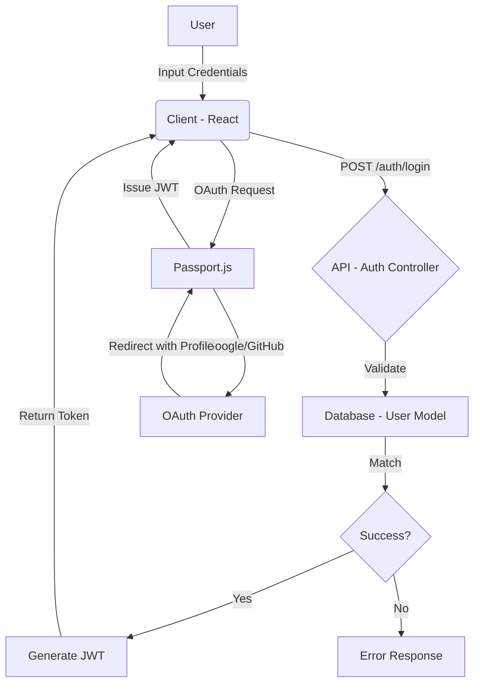
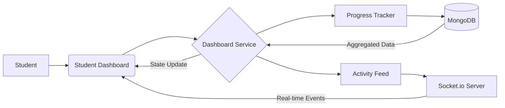
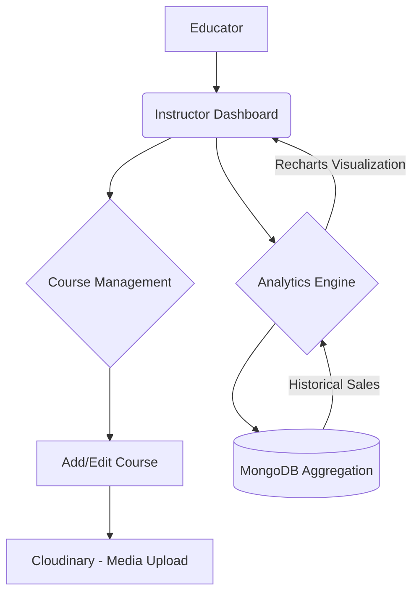
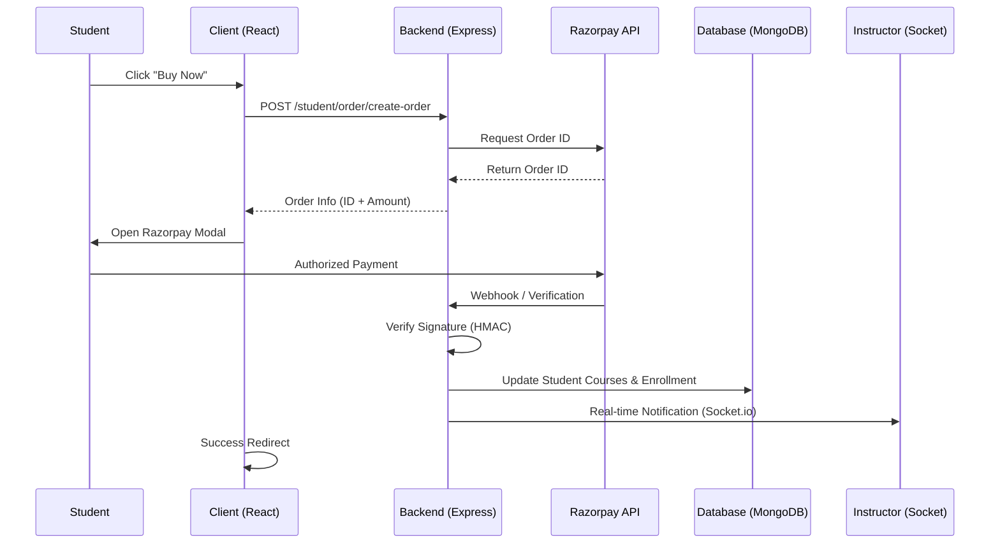

# SkillNest – A Premium, Scalable Learning Management Platform

SkillNest is an industrial-grade Learning Management System (LMS) designed to bridge the gap between fragmented learning resources and professional skill development. Built from scratch with a focus on modern UI/UX, real-time engagement, and high-performance data handling, SkillNest empowers both educators and learners through a unified, high-fidelity digital ecosystem.

---

## 📖 Overview
SkillNest is more than just a course repository; it's a dynamic learning engine. It solves the problem of disconnected educational tools by providing a centralized platform where educators can build, manage, and scale their teaching business, while students benefit from a high-performance, interactive learning journey with real-time feedback and progress visualization.

---

## ✨ Features

### 🎓 For Students
- **Smart Course Discovery**: Advanced filtering and search functionality to find relevant skills indexed by category and level.
- **Seamless Enrollment**: Integrated **Razorpay** payment gateway for instant, secure course access.
- **Interactive Learning Journey**: A premium lecture player with automated progress tracking and persistence across devices.
- **Activity Feed**: Real-time updates on achievements, new course drops, and peer engagement.
- **Student Dashboard**: Data-driven insights into learning speed, course completion rates, and historical purchase records.

### 👨‍🏫 For Educators
- **Advanced Course Builder**: A modular, multi-step curriculum creator with support for high-definition video uploads (Cloudinary).
- **Sales & Engagement Analytics**: Deep-dive reporting using Recharts to track revenue, enrollment spikes, and student drop-off points.
- **Real-Time Instructor Console**: Instant notifications for student enrollments and reviews powered by **Socket.io**.
- **Student Management**: Direct oversight of learners, progress monitoring, and engagement metrics.

### 🛡 Core System
- **Hybrid Authentication**: Secure JWT-based registration paired with **OAuth2 (Google & GitHub)** for frictionless onboarding.
- **Global Support Hub**: Integrated help-center with categorized knowledge bases and direct support messaging.
- **Responsive Mastery**: A mobile-first, fluid UI design ensuring a premium experience on any screen size.

---

## 🛠 Tech Stack

| Layer | Technology |
| :--- | :--- |
| **Frontend** | React (Vite), Tailwind CSS, Framer Motion, Lucide Icons |
| **Backend** | Node.js, Express.js (Modular MVC Pattern) |
| **Database** | MongoDB, Mongoose ODM |
| **Real-time** | Socket.io |
| **Media Host** | Cloudinary |
| **Payments** | Razorpay |
| **Auth** | JWT, Passport.js (OAuth2) |

---

## 🏗 Architecture & System Design
SkillNest follows a **Modular Monolith architecture** with a clear separation of concerns using the MVC (Model-View-Controller) design pattern.

- **Frontend Architecture**: Atomic component design utilizing Radix UI for accessibility and Tailwind CSS for utility-first styling. Global state management for authentication and notifications.
- **Backend Architecture**: A modular system where each domain (Auth, Course, Student, Instructor) is encapsulated in its own module with dedicated routes, controllers, and services.
- **Real-time Event Flow**: Socket.io handles cross-module communication for notifications and live activity feeds without increasing database polling overhead.
- **Payment Lifecycle**: Secure Razorpay integration utilizing backend order creation, frontend checkout triggers, and signed webhook verification for safe enrollment updates.

---

## 📊 High-Level Architecture & Workflows

### 🔐 1. Authentication Workflow (Hybrid JWT + OAuth)
SkillNest uses a secure, ticket-based OAuth system and stateless JWT for session management.


### 📈 2. Student Dashboard Ecosystem
Real-time interaction and progress tracking powered by Socket.io and MongoDB Aggregations.


### 🛠 3. Educator Management Path
Automated course lifecycle management from curriculum design to media delivery.


### 💸 4. Transaction & Enrollment Lifecycle
A secure, signature-verified payment loop ensures data integrity during financial exchange.


---

## 🚀 Installation & Setup

### Prerequisites
- Node.js (v18+)
- MongoDB Atlas (or local instance)
- Razorpay, Cloudinary, and Google/GitHub OAuth API Keys

### Step-by-Step Setup

1. **Clone the Repository**
   ```bash
   git clone https://github.com/your-username/skillnest.git
   cd skillnest
   ```

2. **Backend Configuration**
   ```bash
   cd api
   npm install
   ```
   Create a `.env` file in the `api` folder:
   ```env
   MONGO_URL=your_mongodb_url
   JWT_SECRET=your_secret
   SESSION_SECRET=your_session_secret
   RAZORPAY_KEY_ID=your_key
   RAZORPAY_KEY_SECRET=your_secret
   CLOUDINARY_CLOUD_NAME=your_cloud_name
   # Add Social Auth keys for Google/GitHub
   ```

3. **Frontend Configuration**
   ```bash
   cd ../client
   npm install
   ```
   Create a `.env` file in the `client` folder:
   ```env
   VITE_API_URL=http://localhost:5000
   ```

4. **Run Application**
   ```bash
   # In api folder
   npm run dev
   
   # In client folder
   npm run dev
   ```

---

## 📁 Folder Structure

```text
skillnest/
├── api/                  # Node.js/Express Backend
│   ├── src/
│   │   ├── modules/      # Domain-specific logic (Auth, Course, etc.)
│   │   ├── models/       # Mongoose Database Schemas
│   │   ├── config/       # Passport, DB, and Cloudinary config
│   │   └── utils/        # Shared services (Sockets, logic helpers)
│   └── index.js          # Server entry point
├── client/               # React/Vite Frontend
│   ├── src/
│   │   ├── components/   # Reusable UI components
│   │   ├── pages/        # Route-specific views
│   │   ├── context/      # Auth & Global state providers
│   │   └── services/     # API interaction layer
│   └── tailwind.config.js
└── README.md
```

---

## 🔌 API Documentation

### Authentication
- `POST /auth/register` - Create a new user account.
- `POST /auth/login` - Authenticate user and receive JWT.
- `GET /auth/check-auth` - Validate current session status.

### Student Modules
- `GET /student/course/get` - Fetch all public courses with optional filters.
- `POST /student/order/create-order` - Create a Razorpay order for enrollment.
- `GET /student/courses-bought/get/:id` - Retrieve enrolled courses for a specific user.

### Instructor Modules
- `POST /instructor/course/add` - Create a new course curriculum.
- `GET /instructor/analytics` - Fetch historical sales and engagement data.
- `PUT /instructor/course/update/:id` - Modify existing course content.

---

## 🧠 Challenges & Solutions

- **Challenge**: Coordinating real-time "Activity Feeds" without high server load.
  - **Solution**: Implemented an event-driven pub-sub model using Socket.io, allowing the server to push updates only when specific "Activity" events are triggered in the database.
- **Challenge**: Ensuring secure and idempotent payments.
  - **Solution**: Developed a multi-stage payment verification system that uses Razorpay's HMAC signature verification via webhooks to prevent duplicate enrollments or "man-in-the-middle" payment spoofing.
- **Challenge**: Visualizing complex student metrics.
  - **Solution**: Built a dedicated analytics aggregation engine using MongoDB's `$facet` and `$group` pipelines to deliver pre-calculated stats to the Recharts frontend.

---

## ✅ Demo User Credentials

Use these accounts to explore the platform:

| Role | Email | Password |
| :--- | :--- | :--- |
| **Student** | `student1@gmail.com` | `student1` |
| **Instructor** | `educator1@gmail.com` | `educator1` |

---

## 🗺 Roadmap
- [ ] AI-Powered Personalized Course Recommendations
- [ ] Interactive Live Quiz & Gamification Engine
- [ ] Mobile Application (React Native extension)
- [ ] Multi-instructor Collaboration Portals

---

## 🤝 Contributing
1. Fork the Project.
2. Create your Feature Branch (`git checkout -b feature/AmazingFeature`).
3. Commit your Changes (`git commit -m 'Add some AmazingFeature'`).
4. Push to the Branch (`git push origin feature/AmazingFeature`).
5. Open a Pull Request.

---

## 📄 License
Distributed under the MIT License. See `LICENSE` for more information.

---

## 👤 Author
**Anubhav**
- GitHub: [your-github-handle](https://github.com/your-username)
- LinkedIn: [Your Profile](https://linkedin.com/in/your-profile)
- Email: your-email@example.com
